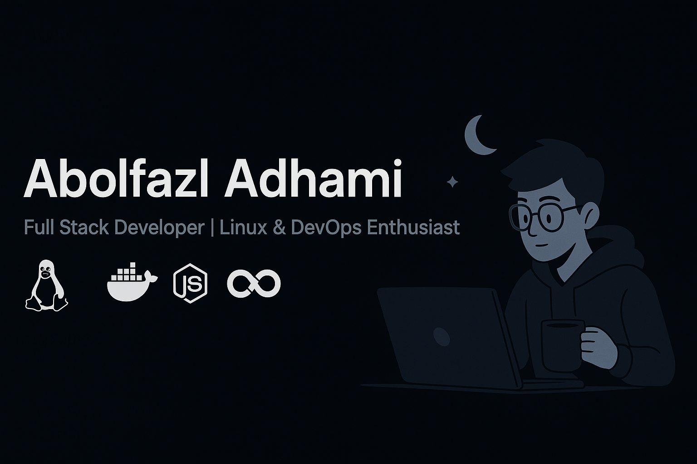

<!-- Profile README -->

  

 
 
 
 

<h1 align="center">🌙 Hi! My name is Abolfazl Adhami</h1>
<h3 align="center">Geek Boy | Full Stack Developer | Linux & DevOps Enthusiast ☕</h3>

 
 

  

---
 

### 🖤 About Me
- 🖥️ Focused on **Back-End Development**  
- 🐧 Passionate about **Linux & DevOps**  
- ⚡ Experienced in **JavaScript, TypeScript, Python**  
- 🌌 Coding at night + coffee + music = the best feeling ever  

 

---
 

### ⚒️ Tech Stack & Tools

  
  
  
  
  
  
  

 

---

<!--
### 📊 GitHub Stats

  
  

---
-->

### 📈 Overall Activity

  

  
  

 

 
 
 

 
 
 

---

### 🌐 Connect with Me

  
  
  

---

⭐️ Life is all about coding at night with coffee — if you like my projects, give them a **Star**!  

